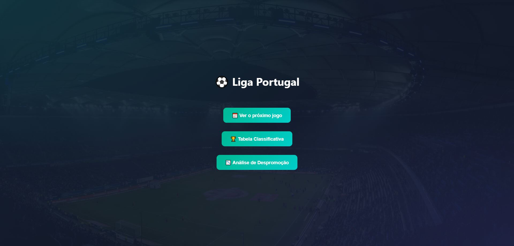

# Liga Portugal Tracker

A lightweight web app that turns Liga Portugal data into something you can explore fast: upcoming fixtures, the live table, and a simple relegation safety check. Built for fans who want the essentials without the noise.

## Live Demo

Vercel app: https://liga-portugal-tracker.vercel.app/

## Preview

	

## What This Project Does

- Lets you pick any team and instantly see its next scheduled league match
- Shows the current standings with visual cues for European spots and relegation places
- Runs a quick relegation analysis to estimate safety and remaining requirements

This project uses the football-data.org API and wraps it with a small API proxy so the app can stay clean and focused on the UI.

## Key Features

- **Next Match** - Upcoming fixture for a chosen club, with date, opponent, and home/away
- **Standings Table** - Full league table with Champions League, Europa League, Conference League, playoff, and relegation zones
- **Relegation Analysis** - Checks if a team can still be relegated and how many wins are needed to be mathematically safe

## Getting Started

### Prerequisites

- Node.js 18+
- Free API key from [football-data.org](https://www.football-data.org/)

### Installation

1. Clone the repository
2. Run `npm install`
3. Create a `.env` file based on `.env.example` and add your API key
4. Run `npm run dev`

## Tech Stack

- React 19
- Vite 7
- football-data.org API

## License

MIT
